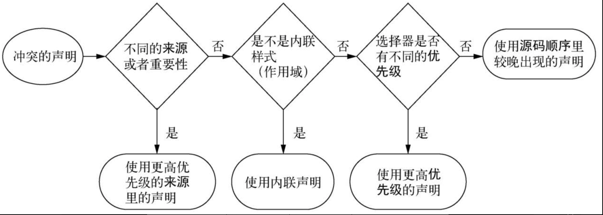

# 1.1 层叠

```
<h1 id="page-title" class="title">Wombat Coffee Roasters</h1>
```

相互冲突的声明如下，分别使用了标签选择器，id选择器，类选择器三种。

```
  <style>
    h1 {
      font-family: serif;
    }

    #page-title {
      font-family: sans-serif;
    }

    .title {
      font-family: monospace;
    }
  </style>
```



当声明冲突时，层叠会依据三种条件解决冲突。

(1) 样式表的来源：样式是从哪里来的，包括你的样式和浏览器默认样式等。

(2) 选择器优先级：哪些选择器比另一些选择器更重要。

(3) 源码顺序：样式在样式表里的声明顺序。

## 1.1.1 样式表的来源

用户自己添加的样式表属于**作者样式表**，除此之外还有**用户代理样式表，即浏览器默认样式**。

