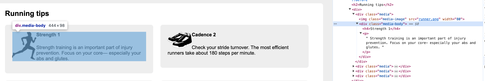

# 4.4 媒体对象和BFC

## 1.问题引入

```
        <div class="media">
          
          <div class="media-body">
            <h4>Change it up 3</h4>
            <p>
              Don't run the same every time you hit the
              road. Vary your pace, and vary the distance
              of your runs.
            </p>
          </div>
        </div>
```


效果是图片在上面，media-body内容部分在下面。虽然img是`inline`，但是下面的media-body是`block`，要独占一行。因此会呈上下排列的布局样式。

期望效果是图片在左，文字区域在右边。

## 2.图片浮动

```
    /* 让图片浮动脱离文档流 */
    .media-image {
      float: left;
    }
```

会看到虽然左右排列了，但是有时候图片下面会出现文字。

其实这也是浮动的初衷，文字默认会包裹浮动的图片。



如果在浏览器开发者工具里检查媒体正文（单击鼠标右键，选择检查或者检查元素），就会发现它的盒子扩展到了最左边，因此它会包围浮动的图片。

理解下这里的问题，图片浮动出去，脱离了文档流，但是后面紧跟的一个`media-body`部分，通过检查工具，可以看到它的区域包括了浮动起来的image部分。这也为什么出现了文字紧挨着图片的下方。

## 3.创建BFC

BFC是网页的一块区域，元素基于这块区域布局。**虽然BFC本身是环绕文档流的一部分，但它将内部的内容与外部的上下文隔离开**。这种隔离为创建BFC的元素做出了以下3件事情。

(1) 包含了内部所有元素的上下外边距。它们不会跟BFC外面的元素产生外边距折叠。

(2) 包含了内部所有的浮动元素。

(3) **不会跟BFC外面的浮动元素重叠**。

使用overflow: auto通常是创建BFC最简单的一种方式。